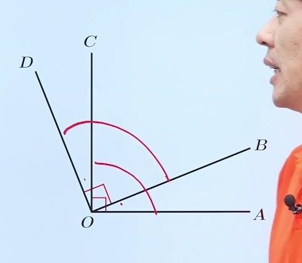
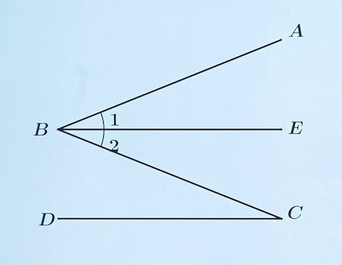

# 证明

> **本讲义由课堂录播视频自动生成，融合了 PPT 关键帧与课堂逐字稿。**
> 课件：数学 · 七年级下册 · 证明

---

## 【知识导入】— 证明的基本概念与定理、公理的区别

### 课堂讲解

**什么是证明？**
由一些真命题通过推理，确认另一个命题为真命题的过程，就叫做证明。简单来说，就是从已知条件出发，通过逻辑推理得出结论的过程。

**定理与公理**
- **定理**：经过证明的真命题可以称为定理。数学中的定理、推论，都需要经过证明才能成立。
- **公理（基本事实）**：有些真命题是人们在长期实践中获得的，不加证明即可直接作为推理依据的事实，称为基本事实（公理）。例如：
  - 两点确定一条直线
  - 两点之间线段最短
  - 在同一平面内，过一点有且只有一条直线与已知直线垂直

**证明中常用的公认事实（等式基本性质）**
- 等量加等量，和相等
- 等量减等量，差相等
- 等量的同倍量相等（两边同乘同一数）
- 等量的同分量相等（两边同除同一非零数）
- **等量代换**：若 A = B 且 B = C，则 A = C（注：依据层面应写"等量代换"，不写"传递性"）

### 📌 学习要点

- 证明是通过推理确认命题为真命题的过程，核心是"有因有果"
- 公理（基本事实）是不需要证明的，而定理和推论需要证明
- 等量代换是证明中使用频率最高的依据之一，书写依据时注意用词规范

---

## 【知识讲解】— 几何证明的基本方法与书写规范

### 例题 1（几何推理入门 — 角度关系）



> **已知**：如图，OA ⊥ OC，OB ⊥ OD  
> **求证**：∠AOB = ∠COD

**推理过程：**

```
∵ OA ⊥ OC（已知）
∴ ∠AOC = 90°（垂直的定义）

∵ OB ⊥ OD（已知）
∴ ∠BOD = 90°（垂直的定义）

∵ ∠AOC = ∠BOD（等量代换）
∴ ∠AOC - ∠BOC = ∠BOD - ∠BOC（等量减等量，差相等）

即 ∠AOB = ∠COD
```

**关键思路**：几何证明首先看条件——垂直条件依据垂直的定义得到 90° 角，然后利用角的和差关系进行推理。

**书写要求**：
- 每一步必须"因为""所以"，有理有据
- 有因无果不完整，无因有果肯定不行
- 演绎推理的实质：大前提 → 小前提 → 结论

**证明过程的简化**：当推理得到的果可以作为下一个推理的因时，过程可以适当简化。例如在上述证明中，得到两个 90° 角后，可以直接根据等量代换得出两角相等。

---

**例题 2（线段和差推理）**
> 已知：如图，CD 是线段 AB 上的两点，AC = BD  
> 求证：AD = BC

**推理过程：**

```
∵ AC = BD（已知）
且 CD = CD（公共线段）
∴ AC + CD = BD + CD（等量加等量，和相等）

即 AD = BC
```

**关键思路**：将题目条件在图上标注出来。两条线段都加上同一条公共线段，问题即可解决。

### 📌 学习要点

- 几何证明的第一步：仔细审题，将条件在图形上标注出来
- 书写格式必须严格遵循"因为...所以..."（∵ ... ∴ ...）的逻辑结构
- 每一步都要有依据——定义、公理、定理、已知条件
- 证明可以适当简化，但不能跳步缺据

---

## 【典例剖析】— 典型例题分析

### 例题 3（角平分线 + 等量代换）



> **已知**：如图，BD 是 ∠ABC 的平分线，∠1 = ∠C  
> **求证**：∠2 = ∠C

**推理过程：**

```
∵ BD 是 ∠ABC 的平分线（已知）
∴ ∠1 = ∠2（角平分线的定义）

∵ ∠1 = ∠C（已知）
∴ ∠2 = ∠C（等量代换）
```

**关键思路**：读完题即可看出结论，关键在于书写规范。角平分线定义提供相等关系，再通过等量代换完成推理。

---

### 课程总结

1. **证明的定义**：由一个或一些真命题，通过推理确认另一个命题为真命题的过程。
2. **定理**：经过证明的真命题可以称为定理。
3. **基本事实**：通过实践得到的、不加证明即可作为推理依据的真命题。
4. **书写要求**：整个证明过程必须有理有据，"因为""所以"逻辑清晰。

---

> *讲义生成时间：自动生成 · 由 PPT 关键帧 + 课堂逐字稿融合生成*
